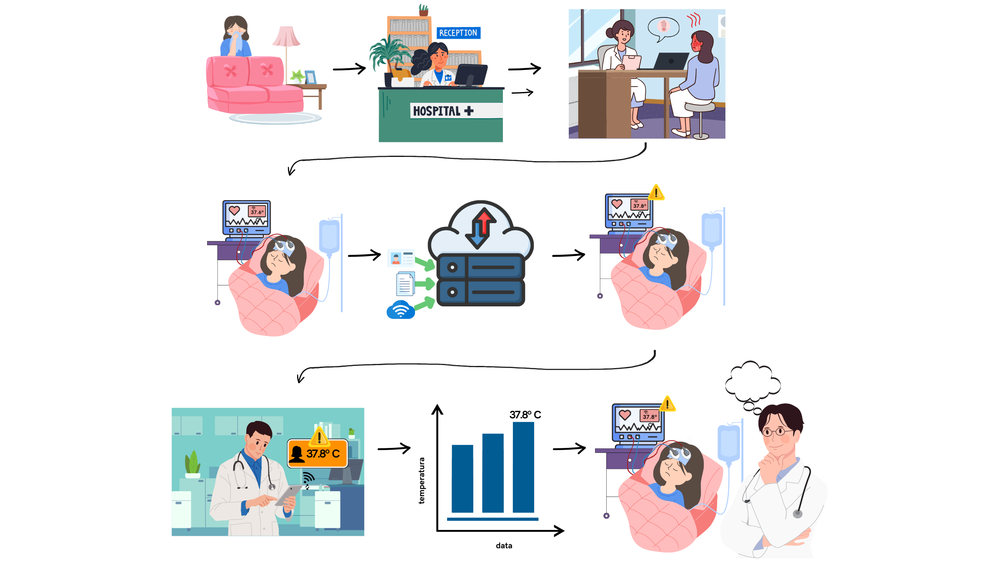
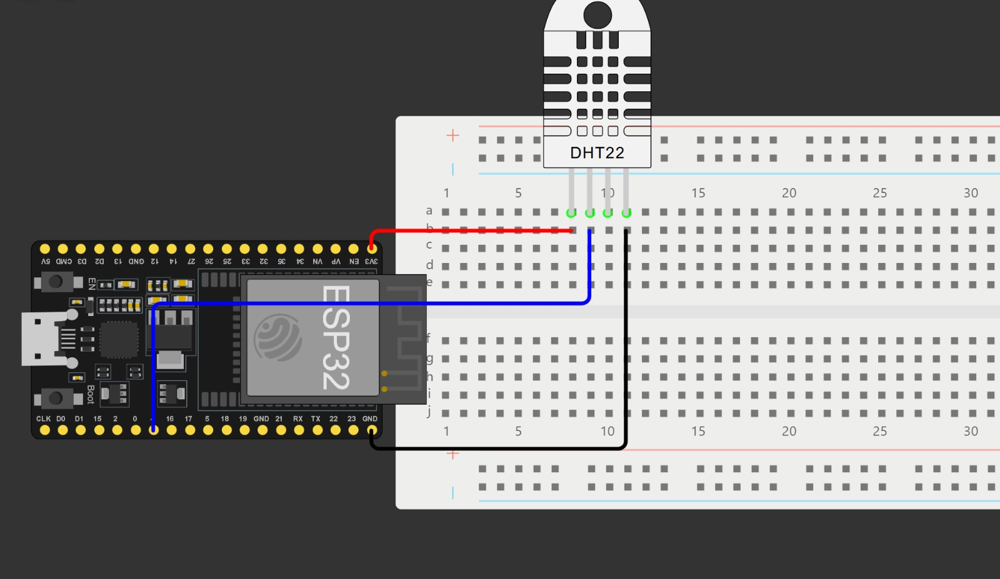

# Maloca das iCoisas - Hands On Básico

Projetos realizados no curso Maloca das iCoisas pelo grupo 13 - Os Suricatos Cibernéticos.

## Big Picture

## Equipe

- **Product Owner**: Marcelle Alencar Urquiza
- **Scrum Master**: Eduardo Henrique Freire Machado

### Equipe de Desenvolvimento

- Eduardo Henrique Freire Machado;
- Gabriel Peixoto Menezes da Costa;
- Natália Ribeiro de Almada;

## Esquema de Conexão

**Conexões**:

- Pino VCC -> 3.3V do ESP32;
- Pino GND -> GND do ESP32;
- Pino Data -> GPIO 4 (ou qualquer pino disponível no ESP32);

### Requisitos

#### Hardware

- ESP32;
- Sensor DHT22;
- Protoboard e fios de conexão;

#### Software

- Arduino IDE com as bibliotecas DHT, WiFi e ThingSpeak;

## Recursos

- [Kanban](https://trello.com/b/ZGD00PBo/hands-on-maloca)
- [Big Picture]()
- [Esquema de Conexão](https://wokwi.com/projects/417194889520795649)
- [Documento de Definição de Pronto](https://docs.google.com/document/d/19DEppOgMY5BuyY0HxtlvK1HDf5n62W19/edit)
- [Documento de Requisitos Funcionais](https://docs.google.com/document/d/17LjGt8pkkPYk2qunanWLQsBvVkvb5q1w/edit)
