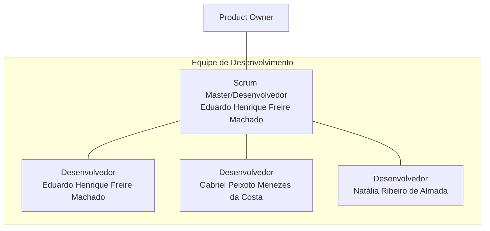

# Maloca das iCoisas - Hands On Básico

Projetos realizados no curso Maloca das iCoisas pelo grupo 13 - Os Suricatos Cibernéticos.

## Equipe

- **Product Owner**
- **Scrum Master**: Eduardo Henrique Freire Machado

### Equipe de Desenvolvimento

- Eduardo Henrique Freire Machado;
- Gabriel Peixoto Menezes da Costa;
- Natália Ribeiro de Almada;
